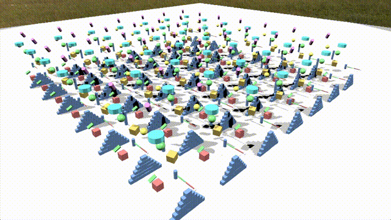

> 🇨🇳 中文版 | 🇺🇸 [English](../README.md)

一款游戏引擎，包含 GPU 加速的物理仿真、基于 Vulkan 的渲染系统、Python 驱动的反射/序列化机制，以及灵活的组件化游戏框架。


## 构建引擎

我们建议使用 **MSYS2 CLANG64** 子系统构建项目并管理依赖包。

### 依赖项

| 依赖 | MSYS2 软件包 |
|---|---|
| Clang 22（工具链） | `mingw-w64-clang-x86_64-toolchain` |
| CMake | `mingw-w64-clang-x86_64-cmake` |
| Ninja | （随 CMake 附带） |
| Python 3 | `mingw-w64-clang-x86_64-python` |
| Vulkan 加载器 + 头文件 | `mingw-w64-clang-x86_64-vulkan-loader` `mingw-w64-clang-x86_64-vulkan-headers` |
| Vulkan 验证层 | `mingw-w64-clang-x86_64-vulkan-validation-layers` |
| glslang（着色器编译器） | `mingw-w64-clang-x86_64-glslang` |
| SDL3 | `mingw-w64-clang-x86_64-sdl3` |
| LLDB（调试器） | `mingw-w64-clang-x86_64-lldb` `mingw-w64-clang-x86_64-lldb-mi` |
| Doxygen（可选） | `mingw-w64-clang-x86_64-doxygen` |

其他第三方依赖（glm、SPIRV-Cross、imgui 等）位于 `third_party` 目录，由 CMake 自动构建。

#### 一键安装

```sh
pacman -S \
  mingw-w64-clang-x86_64-toolchain \
  mingw-w64-clang-x86_64-cmake \
  mingw-w64-clang-x86_64-python \
  mingw-w64-clang-x86_64-vulkan-loader \
  mingw-w64-clang-x86_64-vulkan-headers \
  mingw-w64-clang-x86_64-vulkan-validation-layers \
  mingw-w64-clang-x86_64-glslang \
  mingw-w64-clang-x86_64-sdl3 \
  mingw-w64-clang-x86_64-lldb \
  mingw-w64-clang-x86_64-lldb-mi
```

### 构建步骤

1. 克隆仓库（含子模块）：

```sh
git clone --recursive <仓库地址>
```

2. 使用 CMake 配置。确保 Shell 已激活 CLANG64 环境（`MSYSTEM=CLANG64`，且 `clang64/bin`、`usr/bin` 在 `PATH` 中）：

```sh
cmake --preset debug
```

3. 构建：

```sh
cmake --build --preset debug
```

也提供了 `release` preset，详见 `CMakePresets.json`。

### 运行时环境

运行本项目构建的任何可执行文件前，需要设置以下环境变量：

| 变量 | 值 | 用途 |
|---|---|---|
| `PATH` | 前置 `<msys2>/clang64/bin` 和 `<msys2>/usr/bin` | 查找运行时 DLL（SDL3、Vulkan 加载器、libc++ 等） |
| `VK_LAYER_PATH` | `<msys2>/clang64/bin` | 查找 Vulkan 验证层（Debug 构建） |

其中 `<msys2>` 是你的 MSYS2 安装根目录（例如 `C:\msys2`）。

在 PowerShell 中：

```powershell
$env:Path = "C:\msys2\clang64\bin;C:\msys2\usr\bin;$env:Path"
$env:VK_LAYER_PATH = "C:\msys2\clang64\bin"
./build/debug/test/project_loading_test.exe
```

### VS Code 配置

推荐安装以下 VS Code 扩展：

- **CMake Tools** (`ms-vscode.cmake-tools`)
- **C/C++** (`ms-vscode.cpptools`)
- **CodeLLDB** (`vadimcn.vscode-lldb`) — 用于 LLDB 调试

在 `.vscode/settings.json` 中创建以下内容，将路径替换为你的 MSYS2 实际安装路径：

```jsonc
{
    "C_Cpp.default.configurationProvider": "ms-vscode.cmake-tools",
    "cmake.environment": {
        "MSYSTEM": "CLANG64",
        "PATH": "<msys2>\\clang64\\bin;<msys2>\\usr\\bin;${env:Path}",
        "VK_LAYER_PATH": "<msys2>\\clang64\\bin"
    },
    "cmake.generator": "Ninja",
    "C_Cpp.default.compilerPath": "<msys2>\\clang64\\bin\\clang++.exe",
    "cmake.debugConfig": {
        "type": "lldb",
        "program": "${command:cmake.launchTargetPath}",
        "cwd": "${workspaceFolder}",
        "env": {
            "PATH": "<msys2>\\clang64\\bin;<msys2>\\usr\\bin;${env:Path}",
            "VK_LAYER_PATH": "<msys2>\\clang64\\bin"
        }
    }
}
```

将 `<msys2>` 替换为你的 MSYS2 实际路径（例如 `C:\msys2`）。

## 项目结构

```
docs/                     # 贡献指南和代码规范
wiki/                    # 技术文档
assets/                  # 原始资源文件
builtin_assets/          # 内置资源，供所有项目通用
editor/                  # 引擎编辑器代码
engine/
    Asset/               # 资源管理
    Core/                # 核心功能（数学库、功能模块）
    Framework/           # GameObject、Component、Scene
    Physics/             # GPU 加速的物理引擎
    Reflection/          # 反射和序列化
    Render/              # Vulkan 渲染系统
    UserInterface/       # GUI 系统
example/                 # 可运行的示例游戏
    physics_example/     # 物理仿真演示
projects/                # 示例游戏项目
reflection_parser/       # C++ 反射的 Python 解析器
test/                    # 测试程序
third_party/             # 第三方依赖（glm、SPIRV-Cross 等）
```

## 构建目标

- **editor**：运行引擎编辑器界面的可执行文件
- **engine**：包含核心引擎功能的静态库
- **tests**：可运行的演示程序和测试用例（可通过 CTest 运行）
- **third_party**：链接到 engine 的第三方静态库

## 核心特性

### 1. GPU 物理仿真

 

- **XPBD 求解器** — GPU 加速的基于位置的动力学，支持子步积分、每步碰撞检测、Jacobi 位置/速度约束求解
- **碰撞检测管线** — 空间哈希粗筛阶段配合 AABB 重叠剪枝，随后进入基于 MPR 的窄相接触生成，包含平面拟合和旋转卡壳流形化简
- **碰撞形状** — 盒体、球体、圆柱体三种基本形状，各自具有惯性函数和通用的 `feature` vec3 接口
- **关节约束** — 固定关节（保持相对位姿）和铰链关节（单轴旋转，可配置限位），作为 XPBD 约束在 GPU 上求解
- **刚体动力学** — 重力、力/力矩积分、线速度/角速度阻尼、动态/运动学类型、摩擦和弹性恢复
- **GPU 并行算法** — 可复用的计算模块：工作高效的并行前缀扫描、8 位 LSD 基数排序、有序数组的去重压缩
- **物理组件** — `RigidBodyComponent`、`CollisionShapeComponent`、`PhysicsConstraintComponent` 与 GameObject 框架集成；碰撞形状自动挂载到祖先刚体
- **场景构建器** — 声明式 `SceneBuilder` API（`AddBox`、`AddSphere`、`AddCylinder`、`AddDoublePendulum`），快速搭建物理场景

### 2. Vulkan 渲染系统

- 多层描述符集架构管理 uniforms
- 帧间优化的缓冲区管理
- JSON 定义的材质与着色器管线配置
- 自动描述符集分配和绑定
- Push constants 支持高效的矩阵更新
- 物理与渲染子系统使用独立的渲染图

### 3. 高级反射与序列化

- Python 驱动的 C++ 头文件解析，生成运行时类型信息
- 编译时自动生成反射元数据
- 动态类实例化、方法调用和属性访问
- 支持 STL 容器和智能指针的可定制序列化
- 基于 JSON 的序列化格式，带对象关系追踪

### 4. 资源管理系统

- 基于 GUID 的资源标识系统
- 针对专用资源类型的自定义序列化
- 外部资源导入管线

### 5. GameObject 框架

- 层级对象系统，支持父子关系
- 组件化架构处理游戏逻辑
- 受控实例化的世界管理系统

## 文档

- [代码规范](./CODE_STYLE_CN.md) - 编码约定和最佳实践
- [贡献指南](./CONTRIBUTING_CN.md) - 如何参与项目贡献
- [技术维基](../wiki/) - 架构和 API 文档

## 许可证

本项目采用 MIT 许可证。详见 [LICENSE](../LICENSE)。
