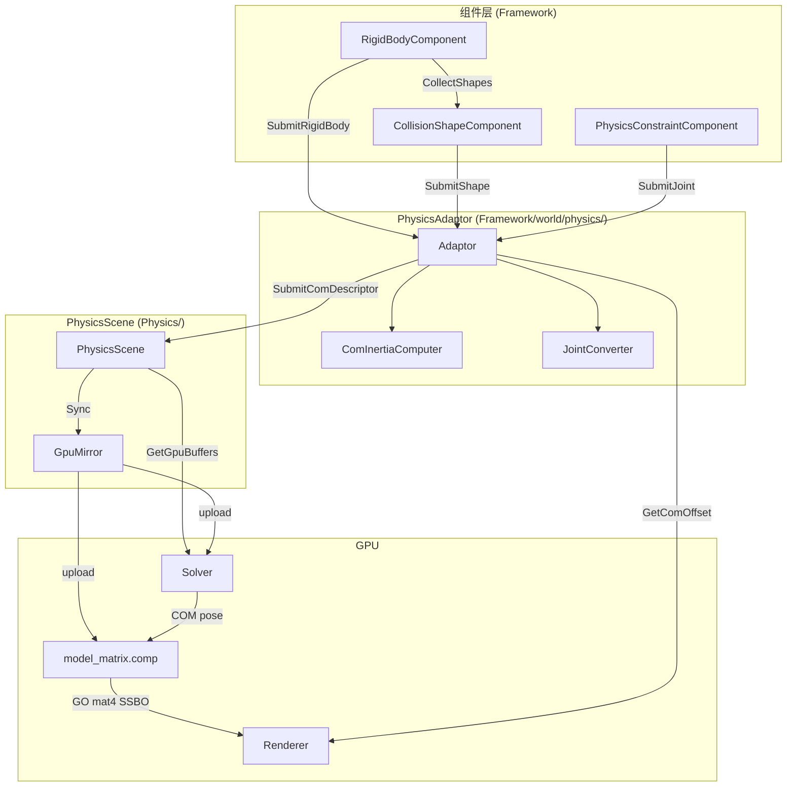

# ADR-0004: PhysicsAdaptor — Separate GO-space and COM-space Responsibilities

## Status

Accepted

## Motivation

`PhysicsScene` had accumulated responsibilities in both GO space (GameObject handles, world transforms,
COM computation from shape geometry, GO→COM coordinate conversions) and COM space (SoA storage, GPU
buffer sync, solver-facing data). This caused three problems:

1. **Shallow interface** — `RegisterRigidBody(12 params)` and `SetRigidBodyProperties(9 params)`
   exposed every internal SoA column to component callers. Adding one property touched 7+ locations.
2. **Leaky dependency** — `engine/Physics/PhysicsScene.cpp` included `Framework/object/GameObject.h`,
   `Framework/world/Scene.h`, `Framework/component/physics/CollisionShapeComponent.h`. The Physics
   module depended on Framework types it should not know about.
3. **Mixed concerns** — COM computation, GO→COM conversion, collision filter ObjectHandle resolution,
   model matrix activation, and GPU buffer sync lived in one 1329-line class.

The goal is a clean split: **GameObject/Component logic stays in Framework; Physics storage stays in
Physics and knows only COM space.**

---

## Decision: Introduce PhysicsAdaptor

**PhysicsAdaptor** lives in `Framework/world/physics/` and is owned by `Scene`. It is the sole bridge
between GO space and COM space. Components never see `PhysicsScene` directly.

### File structure

```
engine/Framework/world/physics/
  PhysicsAdaptor.h            // public: Adaptor interface (exposed to components, renderers, Scene)
  PhysicsDescriptors.h        // public: all Descriptor structs (both GO-space and COM-space)
  Internal/
    ComInertiaComputer.hpp    // internal: pure math — COM + inertia + shape local poses
    JointConverter.hpp         // internal: pure math — GO→COM joint conversion
```

- Public headers use `.h`; internal headers use `.hpp` and live under `Internal/`.
- `ComInertiaComputer` and `JointConverter` are pure functions — no internal state, no Framework
  dependencies beyond math types. They are testable with synthetic inputs.

### Hard constraint

`engine/Physics/` must **never** include any Framework headers (`GameObject.h`, `Scene.h`, component
headers, `ObjectHandle`). The four existing reverse #includes will be removed as part of this change.

---

## D-1: Scene Integration

Scene gains three new methods:

```cpp
class Scene {
    PhysicsAdaptor& GetPhysicsAdaptor();  // lazy-create on first access
    PhysicsScene&   GetPhysicsScene();    // preserved (solver registration needs it)
    void FlushPhysics(RenderSystem&);     // called by main loop after ProcessEvents
};
```

`Scene::FlushPhysics` delegates to `m_physics_adaptor.Flush(render_system)` then
`m_physics_scene.SyncGpuBuffers(render_system)`.

The main loop timing (from ADR-0002) becomes:

```
ProcessEvents()          ← Init fires, components submit GO Descriptors
scene.FlushPhysics()     ← Adaptor processes pending, submits COM Descriptors, syncs GPU
UpdateRendererData()     ← renderers query Adaptor for offsets
PreGPUStep → GPUStep     ← solver operates on COM-space GPU buffers
```

---

## D-2: Component Lifecycle

### Awake — Allocate slots only. No property values, no binding.

```cpp
// RigidBodyComponent::Awake
m_rb_index = adaptor->AllocateSlot(GetParentGameObject()->GetHandle());

// CollisionShapeComponent::Awake
m_shape_index = adaptor->AllocateShapeSlot(GetHandle());

// PhysicsConstraintComponent::Awake
for each joint: m_joint_indices[i] = adaptor->AllocateFixedJoint() or AllocateHingeJoint();
```

`AllocateSlot` is idempotent: if the handle already has an index, return the existing one.

### Init — Build GO-space descriptor from component fields, submit to Adaptor.

```cpp
// RigidBodyComponent::Init
RigidBodyDescriptor desc;
desc.mass = m_mass;
desc.static_friction = m_static_friction;
desc.dynamic_friction = m_dynamic_friction;
desc.restitution = m_restitution;
desc.is_kinematic = m_is_kinematic;
desc.world_position = go->GetWorldTransform().GetPosition();
desc.world_rotation = go->GetWorldTransform().GetRotation();
desc.linear_velocity = m_linear_velocity;
desc.angular_velocity = m_angular_velocity_axis_angle;
desc.external_force = m_external_force;
desc.external_torque = m_external_torque;
desc.use_manual_inertia_com = m_use_manual_inertia_com;
desc.manual_inertia = BuildInertiaMatrix(m_manual_inertia_diag, m_manual_inertia_offdiag);
desc.manual_center_of_mass = m_manual_center_of_mass;
adaptor->SubmitRigidBody(m_rb_index, desc);
// Then: CollectShapesRecursivelyAndBind(adaptor) for bidirectional shape attachment.
```

```cpp
// CollisionShapeComponent::Init
CollisionShapeDescriptor desc = BuildDescriptor(owner);
// BuildDescriptor internally: computes world_center/world_rotation from GO transform,
// handles cylinder non-uniform-scale fallback to box (code lives once here, not duplicated
// in Awake).
adaptor->SubmitShape(m_shape_index, desc);
TryAttachToAncestorRigidBody(adaptor);
```

```cpp
// PhysicsConstraintComponent::Init
for each joint:
    resolve obj2_handle → obj2_index via adaptor->FindRigidBodyByObjectHandle()
    compute initial_rel_pos_local, initial_rel_rotation from GO world transforms
    build FixedJointSubmitData or HingeJointSubmitData
    adaptor->SubmitJoint(joint_idx, data)
```

### RB↔Shape bidirectional binding

Both `RigidBodyComponent::CollectShapesRecursivelyAndBind` and `CollisionShapeComponent::TryAttachToAncestorRigidBody`
are called during Init (not Awake). Whichever runs second completes the binding. Adaptor provides:

```cpp
void BindShapeToRigidBody(uint32_t shape_idx, uint32_t rb_idx);
```

The binding is communicated to PhysicsScene via `CollisionShapeComDescriptor::bound_rigid_body` during Flush.

---

## D-3: Descriptor Structures

### GO-space Descriptors (component → Adaptor, Init phase)

```cpp
struct RigidBodyDescriptor {
    float mass, static_friction, dynamic_friction, restitution;
    bool is_kinematic;
    glm::vec3 world_position;       // GO world pos
    glm::quat world_rotation;       // GO world rot
    glm::vec3 linear_velocity, angular_velocity;
    glm::vec3 external_force, external_torque;
    bool use_manual_inertia_com;
    glm::mat3 manual_inertia;
    glm::vec3 manual_center_of_mass; // GO-local
};

struct CollisionShapeDescriptor {
    CollisionShapeType type;
    glm::vec3 feature;              // Box: half-extents; Sphere: radius.x; Cylinder: radius.x, half_height.y
    glm::vec3 world_position;       // GO world (temporary, not stored in PhysicsScene)
    glm::quat world_rotation;       // GO world (temporary, not stored in PhysicsScene)
    std::vector<ObjectHandle> ignore_collision_objects;
};

struct FixedJointSubmitData {
    uint32_t obj2_index;
    float compliance;
    glm::vec3 initial_rel_pos_local;   // GO-local
    glm::quat initial_rel_rotation;     // GO-local
};

struct HingeJointSubmitData {
    uint32_t obj2_index;
    float compliance;
    glm::vec3 hinge_axis_obj1;          // GO-local
    glm::vec3 hinge_anchor_obj1;        // GO-local
    glm::vec3 initial_rel_pos_local;    // GO-local
    glm::quat initial_rel_rotation;     // GO-local
};

using JointSubmitData = std::variant<FixedJointSubmitData, HingeJointSubmitData>;
```

### COM-space Descriptors (Adaptor → PhysicsScene, Flush phase)

```cpp
struct RigidBodyComDescriptor {
    float mass, static_friction, dynamic_friction, restitution;
    bool is_kinematic;
    glm::vec4 center_world_position;         // COM world pos (Adaptor computed)
    glm::vec4 center_world_rotation;          // COM world rot
    glm::vec4 center_offset_local_position;   // GO→COM offset (Adaptor computed)
    glm::mat4 inertia;                        // (Adaptor computed)
    glm::mat4 inverse_inertia;                // (Adaptor computed)
    glm::vec4 linear_velocity, angular_velocity;
    glm::vec4 external_force, external_torque;
};

struct CollisionShapeComDescriptor {
    uint32_t type;                       // CollisionShapeType enum
    glm::vec4 feature;
    glm::vec4 local_position;            // COM-local pos (Adaptor computed)
    glm::vec4 local_rotation;            // COM-local rot (Adaptor computed)
    uint32_t bound_rigid_body;           // INVALID_INDEX if unbound
    std::vector<uint32_t> ignore_shape_indices;  // resolved from ObjectHandles by Adaptor
};
```

`CollisionShapeComDescriptor` does **not** carry `world_position` or `world_rotation`. These are not
stored in PhysicsScene. Solvers compute them from COM pose + shape local pose when needed.

---

## D-4: PhysicsScene Simplified Interface

`PhysicsScene` is reduced to pure COM-space storage with no knowledge of GO types. All methods use
unified `Submit*` naming:

```cpp
class PhysicsScene {
public:
    // Slot allocation (called by Adaptor)
    uint32_t AllocateRigidBodySlot();      // alive=1, SoA columns zero-initialized
    uint32_t AllocateCollisionShapeSlot();
    uint32_t AllocateFixedJoint();
    uint32_t AllocateHingeJoint();

    // COM-space data submission (called by Adaptor during Flush)
    void SubmitRigidBody(uint32_t idx, const RigidBodyComDescriptor&);
    void SubmitCollisionShape(uint32_t idx, const CollisionShapeComDescriptor&);
    void SubmitFixedJoint(uint32_t idx, const GpuFixedJoint&);
    void SubmitHingeJoint(uint32_t idx, const GpuHingeJoint&);

    // Unregistration
    void UnregisterRigidBody(uint32_t idx);
    void UnregisterCollisionShape(uint32_t idx);
    void UnregisterFixedJoint(uint32_t idx);
    void UnregisterHingeJoint(uint32_t idx);

    // GPU sync
    void SyncGpuBuffers(RenderSystem&);

    // Solver switch
    void SetSimulationEnabled(bool);
    bool IsSimulationEnabled() const;

    // Query
    PhysicsGpuBuffers GetGpuBuffers() const;
    bool IsRigidBodyIndexValid(uint32_t) const;
    bool IsShapeIndexValid(uint32_t) const;
    void DebugPrint() const;
};
```

### What is removed from PhysicsScene

| Removed | Reason |
|---------|--------|
| `ObjectHandle` mappings (`m_rigid_body_to_object`, `m_object_to_rigid_body`, `FindRigidBodyByObjectHandle`) | GO concern, moved to Adaptor |
| `RegisterRigidBody(12 params)`, `SetRigidBodyProperties(9 params)`, `SetRigidBodyTransform` | Replaced by `AllocateSlot` + `SubmitRigidBody(COM descriptor)` |
| `SetRigidBodyManualInertia`, `SetRigidBodyManualCenterOfMass` | Indirect through Descriptor |
| `RecalculateRigidBodyState`, `EnqueueRigidBodyInitialization`, `m_need_init[]`, `m_init_queue` | COM computation moved to Adaptor |
| `ConvertPendingJointUpdates`, `PendingFixedJointUpdate`, `PendingHingeJointUpdate` | GO→COM conversion moved to Adaptor |
| `InitializePendingRigidBodies` | Replaced by `Scene::FlushPhysics` |
| `SetModelMatrixActive`, `IsModelMatrixActive`, `m_model_matrix_active[]` | Moved to Adaptor |
| `ResolveCollisionFilters`, `m_pending_filter_handles[]` | Moved to Adaptor |
| `BindShapeToRigidBody` interface | Binding via Descriptor |
| `m_shape_world_position[]`, `m_shape_world_rotation[]` | Solvers compute these from COM pose + shape local pose |
| `m_gpu_rigid_body_shape_offset`, `m_gpu_rigid_body_shape_count`, `m_gpu_flattened_shape_indices` | Unused by GPU shaders; will be reintroduced if needed |

### What PhysicsScene still owns

| Retained | Purpose |
|----------|---------|
| 15 rigid body SoA columns | COM-space per-body data |
| 6 shape SoA columns (alive, type, feature, local_pos, local_rot, bound_rb) | COM-local per-shape data |
| `m_fixed_joints[]`, `m_hinge_joints[]` | Joint definitions (COM-space, GPU-ready) |
| `m_shape_to_rigid_body[]` (vector) | Per-shape RB binding (not a map; just a vector) |
| 25 `unique_ptr<ComputeBuffer>` members | GPU mirror of all SoA + joints + model matrices |
| `RefreshGpuBuffers` (inlined in `SyncGpuBuffers`) | Buffer creation + staging upload |

---

## D-5: Adaptor Internal Handle Mappings

Adaptor maintains these mappings (none of which exist in PhysicsScene):

| Mapping | Structure | Purpose |
|---------|-----------|---------|
| `ObjectHandle → rb_idx` | `unordered_map` | Component Init, Renderer query |
| `ComponentHandle → shape_idx` | `unordered_map` | Shape component lookup |
| `rb_idx → ObjectHandle` | `unordered_map` | Reverse lookup for collision filter resolution |
| `rb_idx → shape_idx[]` | `unordered_map<uint32_t, vector>` | COM computation needs shape lists |
| `shape_idx → rb_idx` | mirrors PhysicsScene's `m_shape_to_rigid_body[]` | Local binding state |

PhysicsScene only needs `shape_idx → rb_idx` as a simple `vector<uint32_t>`. All other mappings are
Adaptor's responsibility.

---

## D-6: Pending Storage

Adaptor uses `unordered_map<uint32_t, T>` for pending data. Key is slot index; repeated `Submit*`
calls overwrite. No separate `need_init` flags or explicit queues.

```cpp
// Adaptor private members
std::unordered_map<uint32_t, RigidBodyDescriptor>    m_pending_rigid_bodies;
std::unordered_map<uint32_t, CollisionShapeDescriptor> m_pending_shapes;
std::unordered_map<uint32_t, JointSubmitData>          m_pending_joints;
```

---

## D-7: Adaptor::Flush Pipeline

```cpp
void PhysicsAdaptor::Flush(RenderSystem& render_system) {
    // Step 1 — Resolve collision filters
    //   For each pending shape with ignore_collision_objects:
    //     ObjectHandle → lookup GameObject → find CollisionShapeComponent → get shape_idx
    //   Enforce symmetry (A ignores B → B ignores A)
    //   Store resolved indices for use in Step 3.

    // Step 2 — COM + inertia computation (directly from pending descriptors)
    for (auto& [rb_idx, rb_desc] : m_pending_rigid_bodies) {
        // Collect shape data for this RB from m_pending_shapes (GO-world values)
        // Call ComInertiaComputer::Compute(rb_desc, shapes)
        // Build RigidBodyComDescriptor from output + rb_desc scalars
        // Cache: m_com_offsets[rb_idx] = output.center_offset_local (persistent)
        // Cache: shape_poses (temporary, for Step 3)
        m_physics_scene.SubmitRigidBody(rb_idx, com_desc);
    }

    // Step 3 — Shape COM descriptors
    for (auto& [shape_idx, shape_desc] : m_pending_shapes) {
        // Build CollisionShapeComDescriptor:
        //   type/feature from shape_desc
        //   local_pos/rot from cached shape_poses
        //   bound_rigid_body from m_shape_to_rb
        //   ignore_shape_indices from Step 1 resolved data
        m_physics_scene.SubmitCollisionShape(shape_idx, com_desc);
    }

    // Step 4 — Joint conversion (pure function)
    for (auto& [joint_idx, data] : m_pending_joints) {
        // Read obj1/obj2 COM offsets from m_com_offsets (persistent cache)
        // JointConverter::ConvertFixed/ConvertHinge(data, c1, c2) → GpuJoint
        m_physics_scene.SubmitFixedJoint(joint_idx, joint);
    }

    // Step 5 — Clear pending
    m_pending_rigid_bodies.clear();
    m_pending_shapes.clear();
    m_pending_joints.clear();
}
```

`m_com_offsets[rb_idx]` persists after Flush — used by RendererComponent queries
(`GetComOffsetLocal`) and by subsequent Flush calls for joint conversion.

---

## D-8: Internal Module Interfaces

### ComInertiaComputer (pure function, no internal state)

```cpp
struct ShapeComputationData {
    uint32_t shape_index;
    CollisionShapeType type;
    glm::vec3 feature;
    glm::vec3 world_position;    // GO-world, from component Descriptor
    glm::quat world_rotation;
};

class ComInertiaComputer {
public:
    struct Output {
        glm::vec4 center_world_position;
        glm::vec4 center_world_rotation;
        glm::vec4 center_offset_local;       // GO→COM offset
        glm::mat4 inertia;
        glm::mat4 inverse_inertia;
        std::unordered_map<uint32_t, struct { glm::vec4 pos; glm::vec4 rot; }> shape_poses;
    };
    static Output Compute(
        const RigidBodyDescriptor& rb_desc,
        const std::vector<ShapeComputationData>& shapes
    );
};
```

### JointConverter (pure function, no internal state)

```cpp
class JointConverter {
public:
    static GpuFixedJoint ConvertFixed(
        const FixedJointSubmitData& data,
        const glm::vec3& c1,  // obj1 COM offset (GO-local)
        const glm::vec3& c2   // obj2 COM offset (GO-local)
    );
    static GpuHingeJoint ConvertHinge(
        const HingeJointSubmitData& data,
        const glm::vec3& c1,
        const glm::vec3& c2
    );
};
```

Conversion formulas follow ADR-0003:
- Fixed: `com_rel_pos = go_rel_pos + rel_rot * c2 - c1`
- Hinge: `anchor_com = anchor_go - c1`; `com_rel_pos = go_rel_pos + rel_rot * c2 - c1`

---

## D-9: Model Matrix Flow

### Per-frame sequence

1. **Solver** writes COM-world poses to GPU buffers (unchanged).
2. **Solver** runs `model_matrix.comp` at end of its pipeline: COM-world pose + center_offset_local →
   GO-world mat4 → SSBO. This SSBO belongs to `PhysicsScene` (via `GpuMirror`).
3. **RendererComponent::PreRenderUpdate**: queries `adaptor->IsPhysicsActive()`.
   - If false: submits `model_mat_index = -1`, uses GO world transform from `TransformComponent`.
   - If true: queries `adaptor->GetComOffsetLocal(rb_idx)`. Computes offset matrix:
     `offset = translate(local_pos - offset_local) * mat4(local_rot)`. Submits
     `model_mat_index = rb_idx` + offset matrix to rendering system. Rendering system
     composes `model_matrices[rb_idx] * offset` in the vertex shader.

### Adaptor queries for rendering

```cpp
bool     IsPhysicsActive() const;
uint32_t FindRigidBodyByObjectHandle(ObjectHandle) const;
glm::vec3 GetComOffsetLocal(uint32_t rb_idx) const;  // returns cached m_com_offsets[rb_idx]
```

### Two-switch design

| Switch | Owner | Effect |
|--------|-------|--------|
| `IsPhysicsActive()` | Adaptor | Controls whether renderers follow COM or GO. Set by editor Play/Stop. |
| `SetSimulationEnabled()` | PhysicsScene | Controls whether solver steps. When off, solver still outputs model matrices (COM pose frozen). |

This allows pausing physics (SimulationEnabled=false) while rendering still follows the frozen COM
pose. Editor Play sets both ON; Stop sets both OFF. Custom components (e.g., `SimulationToggleComponent`)
can independently toggle `SetSimulationEnabled`.

---

## D-10: Collision Filter Resolution

Performed in Adaptor::Flush, before COM computation.

1. For each pending shape's `ignore_collision_objects` list:
   - For each ObjectHandle: look up the GameObject via `Scene::GetGameObject()`
   - Find the directly-attached `CollisionShapeComponent` on that GameObject
   - Get its `shape_idx` via Adaptor's `ComponentHandle → shape_idx` map
2. Enforce symmetry: if shape A ignores B, ensure B also ignores A.
3. Resolved flat arrays (`m_shape_filter_offset[]`, `m_shape_filter_count[]`, `m_shape_filter_data[]`)
   are sent to PhysicsScene as part of `SubmitCollisionShape` (projected into `ignore_shape_indices`
   in `CollisionShapeComDescriptor`).

---

## D-11: Mermaid 依赖关系图



---

## Considered Options

### D-12: Keep everything in PhysicsScene (rejected)

Would preserve existing interface surface but perpetuate the GO↔COM blur. Adding any new property
or physics feature requires changes across both Framework/ and Physics/ simultaneously.

### D-13: Put Adaptor in Physics/ (rejected)

Would not achieve the goal of making `Physics/` free of Framework dependencies. The Adaptor's core
job is GO-to-COM bridging, which inherently needs Framework types.

### D-14: Adaptor caches COM world transforms for renderer queries (rejected)

Initially considered having Adaptor cache the full COM world transform (pos + rot) for RendererComponent
queries. Rejected because solver may update COM poses on GPU without writing back to CPU. Adaptor only
caches the static COM offset (GO→COM vector), which does not change during simulation.

---

## Consequences

- `Physics/` no longer includes any Framework headers. Four reverse #includes eliminated.
- Adding a rigid body property: add field to GO and COM Descriptors, write-out in Adaptor::Flush and
  PhysicsScene::SubmitRigidBody, add SoA column + GPU buffer. Previously 7+ locations across both modules.
- Existing ADR-0001 (Awake/Init lifecycle) and ADR-0003 (COM offset conversion) remain valid; their
  implementation moves from PhysicsScene to Adaptor.
- Solver and rendering code see minimal functional change: they continue consuming COM-space data through
  the same GPU buffer interface.
- Collision shape `world_position` / `world_rotation` columns removed from PhysicsScene SoA and GPU
  buffers. Broad-phase collision detection will recompute world AABBs from COM pose + shape local pose.
  This requires shader changes in `SpatialHashBroadDetector`.
- RB↔shape flattening GPU buffers (`rigid_body_shape_offset`/`count`/`flattened_indices`) are removed
  since no shader currently consumes them. They will be reintroduced when needed.
- Joint constraints gain `alive` flags and `Unregister*` methods, matching the pattern used by rigid
  bodies and shapes. Solver skips joints with `alive == 0`.
