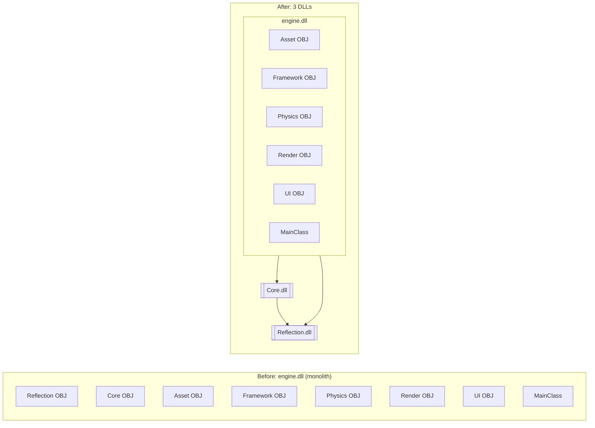

## Context

The engine currently compiles 7 OBJECT libraries (`EngineLibAsset`, `EngineLibCore`, `EngineLibFramework`, `EngineLibPhysics`, `EngineLibReflection`, `EngineLibRender`, `EngineLibUserInterface`) into a single `engine.dll` shared library. All headers are globally visible through `EngineLibHeaderInterface` (which exposes `${ENGINE_SOURCE_DIR}` as an include path), creating no link-time enforcement of module boundaries.

Two specific problems motivate this change:
1. **Core has a reverse dependency on Framework**: `Core/Delegate/ComponentDelegate.h` and `Core/Functional/EventQueue.h` include `<Framework/world/Scene.h>`. Core cannot be a true leaf.
2. **No module-level linking**: All modules are fused into one DLL. Changing a single Physics header forces a full `engine.dll` relink. Tests cannot link only the modules they need.

This change is **Step 1** of the engine modularization roadmap. It extracts the two zero-engine-dependency modules (Reflection and Core) into separate DLLs, establishing a clean Layer 0 foundation. All other modules stay in `engine.dll` as OBJECT libraries — their internal dependency issues (Framework↔Asset, Asset↔Render circular dependencies) are addressed in future steps.

## Goals / Non-Goals

**Goals:**
- Extract `Reflection.dll` and `Core.dll` as standalone shared libraries with minimal public interfaces
- Remove Core's dependency on Framework headers by migrating `ComponentDelegate` and `EventQueue` to Framework
- Remove dead includes from Core (SDLWindow.cpp has unused MainClass.h, RenderTargetTexture.h, vulkan.hpp)
- Split the reflection code generation pipeline into per-module `meta_*` targets
- All existing tests, examples, and editor continue to compile and pass

**Non-Goals:**
- Do NOT split Asset, Framework, Physics, Render, or UI into separate DLLs (future work)
- Do NOT resolve bidirectional dependency cycles (Framework↔Asset, Asset↔Render)
- Do NOT change any public API behavior or data structures
- Do NOT introduce the GPU abstraction layer (`GpuAbstraction.dll`)
- Do NOT elevate WorldSystem out of Framework

## Decisions

### D-1: Two DLLs, not one

**Choice**: Separate `Reflection.dll` (zero engine deps) and `Core.dll` (depends on Reflection.dll).

**Rationale**: Reflection is a true leaf — it only uses std, glm, and nlohmann/json. Core needs Reflection for type registration (Transform serialization) and glm serialization overloads. If they were merged into one DLL, code that only needs GUID/Delegate would unnecessarily pull in nlohmann/json.

**Rejected**: A single `Foundation.dll` containing both. Rejected because Reflection has a distinct responsibility (type system + serialization) from Core (math + callbacks + platform), and the json dependency should not be forced on Core-only consumers.

### D-2: DLL import/export macro strategy

**Choice**: Two separate macros: `REFLECTION_API` (in `Reflection/reflection_export.h`) and `CORE_API` (in `Core/core_export.h`).

```cpp
// Reflection/reflection_export.h
#ifdef _WIN32
  #ifdef REFLECTION_DLL_EXPORTS
    #define REFLECTION_API __declspec(dllexport)
  #else
    #define REFLECTION_API __declspec(dllimport)
  #endif
#else
  #define REFLECTION_API
#endif

// Core/core_export.h
#ifdef _WIN32
  #ifdef CORE_DLL_EXPORTS
    #define CORE_API __declspec(dllexport)
  #else
    #define CORE_API __declspec(dllimport)
  #endif
#else
  #define CORE_API
#endif
```

**Compile definitions**: The CMake targets set `REFLECTION_DLL_EXPORTS` when building `Reflection.dll` and `CORE_DLL_EXPORTS` when building `Core.dll`. Consumer targets see `dllimport`.

**Rejected**: A single `ENGINE_API` macro. Rejected because there is no single "engine" any more — Reflection is imported by Core, Core is imported by engine, and each needs independent import/export control.

### D-3: Per-module code generation and type registration

**Choice**: Create `meta_core` code gen target alongside the existing `meta_engine`. No `meta_reflection` target needed — Reflection has zero `REFL_SER_CLASS` annotated types.

**Target state**:
```
engine/Core/__generated__/
  meta_core/        # Core types only (Transform)
engine/__generated__/
  meta_engine/      # Asset, Framework, Physics, Render, UI, UserInterface types
```

**Wrapper file changes**: The wrapper `.inc` under each module's `__generated__/` directory must include from the correct meta directory. For example, `engine/Core/Math/__generated__/Transform.h.inc` becomes:
```cpp
#include ".../__generated__/meta_core/1_registrar_impl_Transform.h.inc"
#include ".../__generated__/meta_core/1_serialization_impl_Transform.h.inc"
```

**CMake changes** (Core/CMakeLists.txt only):
```cmake
add_reflection_parser(
    target_name meta_core
    reflection_search_files "${CORE_REFLECTION_HEADERS}"   # Core headers with REFL_SER_CLASS
    generated_code_dir "${CMAKE_CURRENT_SOURCE_DIR}/__generated__"
)
```

**meta_engine moved to engine/CMakeLists.txt** (previously in Reflection/CMakeLists.txt):
```cmake
file(GLOB_RECURSE HEADERS "./*.h")
list(FILTER HEADERS EXCLUDE REGEX "__generated__/.*")
list(FILTER HEADERS EXCLUDE REGEX "Tests/.*")
list(FILTER HEADERS EXCLUDE REGEX "Core/.*")
list(FILTER HEADERS EXCLUDE REGEX "Reflection/.*")
filter_files_with_reflection_macros(HEADERS REFLECTION_SEARCH_HEADERS)

add_reflection_parser(
    target_name meta_engine
    reflection_search_files "${REFLECTION_SEARCH_HEADERS}"
    generated_code_dir "${ENGINE_SOURCE_DIR}/__generated__"
    parent_projects meta_core_generation
)
add_dependencies(engine meta_engine)
target_link_libraries(engine PRIVATE meta_engine)
```

**Rejected**: Continue using a single `meta_engine` target for all modules. Rejected because the registrar code for Core types must be compiled into Core.dll, not engine.dll.

#### D-3a: Type registration init flow

The generated `reflection_init.inc` currently lives in `reflection.cpp` (Reflection module) and calls ALL type registrars including `Register_Engine6Transform9()` which is defined in Core.dll. This would create a circular DLL dependency (Reflection.dll → Core.dll).

**Solution**: Each DLL provides its own registration entry point. `Reflection::Initialize()` only calls `RegisterBasicTypes()`. The per-DLL registration functions are called explicitly by `MainClass`:

```cpp
// Reflection/reflection.cpp
void Initialize() {
    Registrar::RegisterBasicTypes();
    // NO LONGER calls RegisterAllTypes()
}

// Core.dll exports:
CORE_API void RegisterCoreTypes();   // calls meta_core/reflection_init.inc

// engine.dll internal (MainClass.cpp directly includes meta_engine/reflection_init.inc):
// RegisterAllTypes() — static linkage, no collision with meta_core's version

// MainClass::Initialize() order:
Reflection::Initialize();             // 1. Basic types (int, float, glm::vec3...)
Core::RegisterCoreTypes();            // 2. Transform
RegisterAllTypes();                   // 3. Asset, Framework, Physics types (from meta_engine/reflection_init.inc)
```

The `reflection_init.inc` is split into per-module versions emitted by each `meta_*` target.

### D-4: File migrations

**Move**:
- `engine/Core/Delegate/ComponentDelegate.h` → `engine/Framework/component/ComponentDelegate.h`
- `engine/Core/Functional/EventQueue.h` → `engine/Framework/world/EventQueue.h`
- `engine/Core/Functional/EventQueue.cpp` → `engine/Framework/world/EventQueue.cpp`

**Delete dead includes** from `engine/Core/Functional/SDLWindow.cpp`:
- `#include <MainClass.h>` (unused — no MainClass types referenced in the file)
- `#include <Render/Memory/RenderTargetTexture.h>` (unused)
- `#include <vulkan/vulkan.hpp>` (unused)

**Update references** (4 files):
- `engine/Framework/world/Scene.cpp`: `#include <Core/Functional/EventQueue.h>` → `#include "EventQueue.h"`
- `engine/Framework/world/WorldSystem.cpp`: same change
- `engine/MainClass.cpp`: same change
- `example/editor_run_game_example/main.cpp`: same change

### D-5: CMake target restructuring

**Before**:
```cmake
# engine/CMakeLists.txt
add_library(EngineLibReflection OBJECT ${SOURCE})   # → engine.dll objects
add_library(EngineLibCore       OBJECT ${SOURCE})   # → engine.dll objects
# ... 5 more OBJECT libs ...
add_library(engine SHARED
    $<TARGET_OBJECTS:imgui>
    $<TARGET_OBJECTS:EngineLibAsset>
    $<TARGET_OBJECTS:EngineLibCore>        # ← removed
    $<TARGET_OBJECTS:EngineLibFramework>
    $<TARGET_OBJECTS:EngineLibPhysics>
    $<TARGET_OBJECTS:EngineLibReflection>   # ← removed
    $<TARGET_OBJECTS:EngineLibRender>
    $<TARGET_OBJECTS:EngineLibUserInterface>
)
```

**After**:
```cmake
# In Reflection/CMakeLists.txt:
add_library(Reflection SHARED ${SOURCE})     # ← NEW: standalone DLL
target_link_libraries(Reflection PRIVATE EngineDepGlm EngineDepJson)

# In Core/CMakeLists.txt:
add_library(Core SHARED ${SOURCE})           # ← NEW: standalone DLL
target_link_libraries(Core PUBLIC Reflection EngineDepGlm EngineDepSdl)

# In engine/CMakeLists.txt:
add_library(engine SHARED
    $<TARGET_OBJECTS:imgui>
    $<TARGET_OBJECTS:EngineLibAsset>
    $<TARGET_OBJECTS:EngineLibFramework>
    $<TARGET_OBJECTS:EngineLibPhysics>
    $<TARGET_OBJECTS:EngineLibRender>
    $<TARGET_OBJECTS:EngineLibUserInterface>
    MainClass.cpp                             # ← still in engine.dll
)
target_link_libraries(engine PUBLIC Core Reflection EngineLibExternalDependency EngineLibHeaderInterface)

# meta_engine reflection code generation (moved here from Reflection/CMakeLists.txt):
file(GLOB_RECURSE HEADERS "./*.h")
list(FILTER HEADERS EXCLUDE REGEX "__generated__/.*")
list(FILTER HEADERS EXCLUDE REGEX "Tests/.*")
list(FILTER HEADERS EXCLUDE REGEX "Core/.*")
list(FILTER HEADERS EXCLUDE REGEX "Reflection/.*")
filter_files_with_reflection_macros(HEADERS REFLECTION_SEARCH_HEADERS)
add_reflection_parser(
    target_name meta_engine
    reflection_search_files "${REFLECTION_SEARCH_HEADERS}"
    generated_code_dir "${ENGINE_SOURCE_DIR}/__generated__"
    parent_projects meta_core_generation
)
add_dependencies(engine meta_engine)
target_link_libraries(engine PRIVATE meta_engine)
```

#### D-5a: Granular external dependency INTERFACE targets

The monolithic `EngineLibExternalDependency` is split into fine-grained INTERFACE targets so that each DLL links only the external libraries it actually needs:

```cmake
# Replace EngineLibExternalDependency with:
add_library(EngineDepGlm    INTERFACE)  # glm only + GLM_FORCE_DEPTH_ZERO_TO_ONE
add_library(EngineDepJson   INTERFACE)  # nlohmann/json only
add_library(EngineDepSdl    INTERFACE)  # SDL3::SDL3 only
add_library(EngineDepVulkan INTERFACE)  # Vulkan::Vulkan + vma + glslang + VULKAN_HPP_* defs
add_library(EngineDepImgui  INTERFACE)  # imgui

# Per-DLL dependencies:
# Reflection → EngineDepGlm, EngineDepJson
# Core       → EngineDepGlm, EngineDepSdl
# Physics    → EngineDepGlm, EngineDepVulkan (via engine.dll OBJECT lib, not direct)
# Render     → EngineDepGlm, EngineDepVulkan (via engine.dll OBJECT lib)
# UI         → EngineDepGlm, EngineDepSdl, EngineDepImgui (via engine.dll OBJECT lib)
```

The OBJECT libraries (`EngineLibAsset`, `EngineLibFramework`, etc.) still transitively receive external deps through the `engine` target's PUBLIC link. Only Reflection.dll and Core.dll need explicit per-dep linking.

**DLL copy commands**: The `engine` target's POST_BUILD must also copy `Core.dll` to the output directory (it currently only copies SDL3 and ktx).

### D-6: Dependency graph transition



### D-7: export/import annotations

Classes and free functions that must be exported from `Reflection.dll`:
- `Engine::Reflection::Type` (and all public methods)
- `Engine::Reflection::TypeRegistrar` (static methods)
- `Engine::Reflection::Field`, `Method`, `Var`
- `Engine::Serialization::Archive`
- `Engine::Serialization::serialize<T>()`, `deserialize<T>()` template specializations
- `Engine::Serialization::save_to_archive<glm::*>()`, `load_from_archive<glm::*>()`
- Static members: `Type::s_index_type_map`, `Type::s_name_index_map`

Template classes (header-only) do NOT need export annotations — they are instantiated in the consuming TU:
- `Engine::Delegate<Args...>`, `Event<Args...>`, `FuncDelegate<Args...>`, `DelegateBase<Args...>` (in Core)
- `Engine::Flags<T>` (in Core)
- Serialization templates for std containers (in Reflection)

For Core.dll, the `Transform` class does NOT need `CORE_API` because it is used via its generated serialization functions which route through Reflection.dll's exported `serialize<T>()`.

### D-8: Clean up serialization includes from header files

**Choice**: Move serialization-specific includes from `.h` files to their corresponding `.cpp` or generated `.inc` files.

**Rationale**: Several header files include `<Reflection/serialization_glm.h>` or other serialization headers that are only needed by the generated serialization code, not by the class declaration itself. For example, `Transform.h` includes `<Reflection/serialization_glm.h>` but only uses types already forward-declared in `<Reflection/macros.h>`. The actual `save_to_archive<glm::*>` calls happen in the generated `_serialization_impl_Transform.h.inc` which already includes `<Reflection/serialization.h>` (transitively includes serialization_glm.h).

**Actions**:
- Remove `#include <Reflection/serialization_glm.h>` from `engine/Core/Math/Transform.h`
- Audit other `.h` files for unnecessary serialization includes — move to `.cpp` or generated `.inc`

### D-9: Include path policy

**Choice**: Keep the global include path (`${ENGINE_SOURCE_DIR}` exposed via `EngineLibHeaderInterface`) for all DLLs.

**Rationale**: Changing to per-DLL include paths would require restructuring header directories (e.g., adding `public/` subdirectories) and updating all include statements across the codebase. This is orthogonal to the DLL split and adds significant churn for marginal benefit at this stage.

**Future work**: After the DLL split stabilizes, switch to per-DLL `PUBLIC_HEADER` directories to enforce compile-time module boundaries. Recorded as a future improvement in CONTEXT.md.

## Risks / Trade-offs

### Risk 1: Type registration across DLL boundaries
The generated `Register_Engine6Transform9()` function is defined in Core.dll (via `Transform.cpp` → generated `.inc`), but called from `reflection_init.inc` which was historically included in `reflection.cpp` (Reflection module). Splitting would create a circular dependency.

**Mitigation**: The `reflection_init.inc` is split per DLL. `Reflection::Initialize()` calls only `RegisterBasicTypes()`. Each DLL exports a `Register*Types()` function. `MainClass::Initialize()` calls them in order: Reflection → Core → engine. See D-3a.

### Risk 2: Template instantiation across DLL boundaries
Some serialization templates (e.g., `serialize<std::vector<T>>`) may need explicit instantiation in Reflection.dll to avoid duplicate symbol errors when Core.dll and engine.dll both instantiate them.

**Mitigation**: The existing pattern uses header-only serialization templates with SFINAE. Since they are templates, they are instantiated in each TU and the linker deduplicates. If ODR violations occur, use explicit template instantiation with `extern template` declarations.

### Risk 3: Increased DLL count in output directory
Going from 1 engine DLL (+ SDL3, ktx) to 3 engine DLLs (+ SDL3, ktx). Deployment must copy `Core.dll` and `Reflection.dll` to the output directory.

**Mitigation**: CMake POST_BUILD copy commands handle this automatically. The editor_run_game_example already demonstrates a complex DLL setup (editor.dll + engine.dll).

### Risk 4: Build time regression from meta_* split
Running 3 separate reflection parser passes instead of 1 increases total code generation time. The Python parser startup and libclang initialization are not free.

**Mitigation**: The `parser.cmake` infrastructure already supports incremental runs (via `task_stamped` files). Only changed headers trigger re-parsing. The total header count scanned is the same — just partitioned by module. The overhead is one extra parser startup per build configuration.

## Migration Plan

1. **Phase 1: Clean Core dependencies** (pure refactor, no DLL split yet)
   - Move `ComponentDelegate.h`, `EventQueue.h/.cpp` to Framework
   - Delete dead includes from `SDLWindow.cpp`
   - Update all include paths
   - Verify: `cmake --build --preset debug && ctest --preset debug`

2. **Phase 2: Split Reflection.dll**
   - Create `Reflection.dll` SHARED target in `Reflection/CMakeLists.txt`
   - Add `REFLECTION_API` macro and annotate public types
   - Remove `EngineLibReflection` OBJECT from engine.dll
   - Split `reflection_init.inc`: Reflection keeps only `RegisterBasicTypes()`; the per-type registration calls move to their respective DLLs
   - Update all link dependencies
   - Verify: all tests pass with Reflection as a separate DLL

3. **Phase 3: Split Core.dll**
   - Create `Core.dll` SHARED target in `Core/CMakeLists.txt`
   - Add `CORE_API` macro
   - Create `meta_core` code gen target
   - Add `RegisterCoreTypes()` export (wraps `meta_core/reflection_init.inc`)
   - Remove `EngineLibCore` OBJECT from engine.dll
   - Update `MainClass::Initialize()` to call `Core::RegisterCoreTypes()`
   - Update all link dependencies
   - Verify: all tests pass with both Core and Reflection as separate DLLs

4. **Phase 4: Cleanup**
   - Remove unused OBJECT library declarations
   - Update editor_run_game_example and installer scripts
   - Run full CI pipeline

## Open Questions

1. **Should `OptionHandler` stay in Core?** It uses `<getopt.h>` which is Unix-specific and may require a replacement on Windows. It is a small utility and could be moved to a Tools module or removed if unused. *Decision deferred — keep in Core for now, mark as deprecated candidate.*

2. **Should `guid.cpp` use `__declspec(dllexport)` for GUID methods?** GUID is a value type with all methods inline (in `guid.inl`) or defined in the header. Only the static factory methods (`Sequential()`, `Random()`) and `string()` are in the .cpp. These need `CORE_API` annotations. *Yes, annotate the non-inline methods.*

3. **Should the wrapper `.inc` files use relative or absolute paths?** Currently uses absolute paths. Relative paths would be more portable. *Decision deferred — keep absolute for consistency with existing pattern, address in future codegen improvement.*
